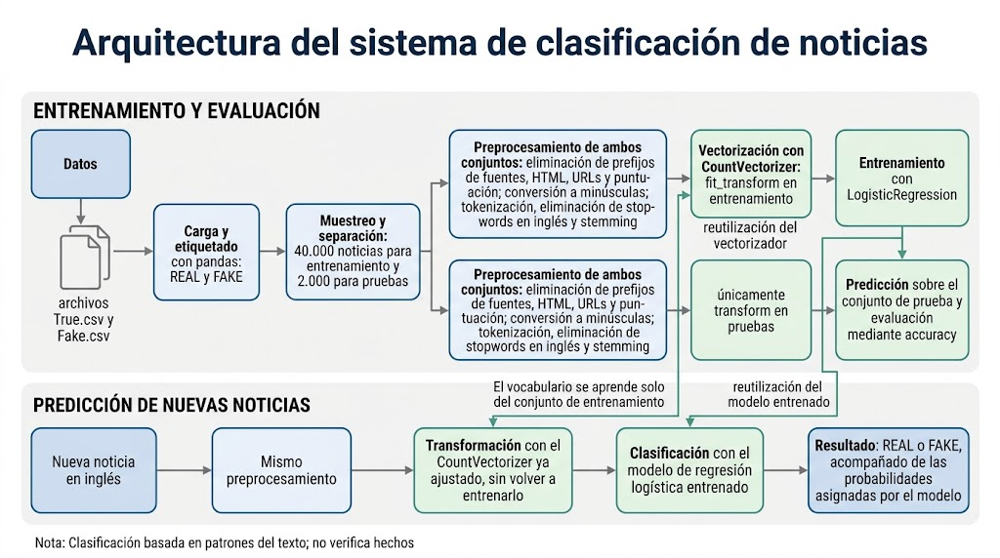

# Detección de Noticias Falsas mediante Machine Learning

Proyecto educativo de clasificación de noticias en inglés mediante **procesamiento de lenguaje natural (NLP)** y **regresión logística en Python**.

El notebook desarrolla el proceso completo: exploración de datos, limpieza del texto, vectorización, entrenamiento, evaluación y predicción de nuevas noticias.

## Arquitectura del proyecto

El sistema contempla dos etapas: entrenamiento y evaluación del modelo, y clasificación de nuevos textos.



Durante el entrenamiento, `CountVectorizer` aprende el vocabulario del conjunto de entrenamiento y la regresión logística aprende a clasificar las noticias.

Para evaluar el modelo y clasificar nuevos textos, se reutilizan el mismo preprocesamiento, el vocabulario aprendido y el modelo entrenado.

## Tecnologías utilizadas

- **Python:** lenguaje de programación.
- **pandas:** carga, exploración y manipulación de datos.
- **BeautifulSoup:** eliminación de etiquetas HTML.
- **NLTK:** tokenización, eliminación de stopwords y stemming.
- **scikit-learn:** vectorización, entrenamiento y evaluación.
- **Jupyter Notebook:** ejecución y documentación del proyecto.

## Conjunto de datos

Se utiliza el [Fake and Real News Dataset de Kaggle](https://www.kaggle.com/datasets/clmentbisaillon/fake-and-real-news-dataset), compuesto por **44.898 noticias**:

- **21.417 noticias reales**, etiquetadas como `REAL`.
- **23.481 noticias falsas**, etiquetadas como `FAKE`.

Los archivos `True.csv` y `Fake.csv` contienen las columnas `title`, `text`, `subject` y `date`. El modelo utiliza el contenido de la columna **`text`** para realizar la clasificación.

## Metodología

### 1. Carga y exploración

Se cargan los archivos CSV, se asigna la etiqueta correspondiente y se combinan en un único DataFrame. Se revisan la distribución de las clases y ejemplos de cada categoría.

### 2. Preprocesamiento del texto

Se aplica la misma función de limpieza a las noticias de entrenamiento, prueba y predicción:

- Eliminación de determinados prefijos que identifican fuentes.
- Eliminación de etiquetas HTML y URLs.
- Conversión a minúsculas.
- Eliminación de puntuación y determinados caracteres especiales.
- Tokenización del texto.
- Eliminación de stopwords en inglés.
- Aplicación de stemming mediante `PorterStemmer`.

### 3. Vectorización

Se utiliza **`CountVectorizer`** para transformar los textos en vectores de frecuencias de palabras, siguiendo el enfoque *Bag of Words*.

En los experimentos de clasificación, el vocabulario se aprende únicamente con los datos de entrenamiento mediante `fit_transform()`. Los datos de prueba y las nuevas noticias se procesan con `transform()`.

### 4. Entrenamiento

Se entrena un clasificador de regresión logística con la siguiente configuración:

```python
LogisticRegression(max_iter=1000)
```

El notebook incluye dos experimentos con distintos tamaños de entrenamiento.

### 5. Evaluación y predicción

Se calcula la **exactitud (*accuracy*)**, que representa la proporción de noticias clasificadas correctamente en el conjunto de prueba.

Finalmente, se clasifican textos nuevos con `predict()` y se consultan las probabilidades asignadas por el modelo mediante `predict_proba()`.

## Resultados

Las salidas guardadas en el notebook muestran:

- **Experimento inicial:** 1.000 noticias de entrenamiento y 500 de prueba, con una accuracy del **95,0 %**.
- **Experimento ampliado:** 40.000 noticias de entrenamiento y 2.000 de prueba, con una accuracy del **98,7 %**.

El muestreo utiliza `random_state=42`. Como los conjuntos de prueba son distintos, la comparación entre ambos experimentos es orientativa.

Estos resultados corresponden a las ejecuciones guardadas en el notebook y pueden variar según el entorno y las versiones de las dependencias.

## Organización de archivos

Para ejecutar el notebook sin modificar sus rutas, organiza los archivos así:

```text
.
├── README.md
├── 5_Regresion_Logistica_Deteccion_Noticias_Falsas.ipynb
├── images/
│   └── arquitectura.png
└── datasets/
    └── Fake_Real_News_Dataset/
        ├── True.csv
        └── Fake.csv
```

Los archivos CSV deben descargarse desde Kaggle y colocarse en la carpeta indicada.

## Cómo ejecutar el proyecto

### 1. Descargar los archivos

Descarga o clona este repositorio y obtén `True.csv` y `Fake.csv` desde la página del dataset. Colócalos en `datasets/Fake_Real_News_Dataset/`.

### 2. Instalar las dependencias

En un entorno con Python 3, ejecuta:

```bash
pip install jupyter pandas beautifulsoup4 nltk scikit-learn
```

### 3. Abrir el notebook

Desde la carpeta del proyecto, inicia Jupyter:

```bash
jupyter notebook
```

Abre `5_Regresion_Logistica_Deteccion_Noticias_Falsas.ipynb` y ejecuta las celdas en orden.

El notebook incluye la descarga de los recursos de NLTK `punkt`, `punkt_tab` y `stopwords`. Su descarga inicial requiere conexión a internet.

El preprocesamiento del experimento ampliado puede tardar varios minutos, dependiendo del equipo.

## Clasificar nuevas noticias

Después de entrenar el modelo, modifica la lista `noticias_nuevas` de la sección final del notebook con textos en inglés y ejecuta las celdas de predicción.

Cada texto pasa por el siguiente flujo:

```text
Texto → Preprocesamiento → Vectorización → Modelo → REAL / FAKE
```

La salida muestra la etiqueta predicha y las probabilidades asignadas a ambas clases.

## Alcance y limitaciones

Este proyecto tiene fines educativos. El modelo aprende patrones asociados a las etiquetas del dataset; **no verifica hechos ni consulta fuentes externas**.

- El preprocesamiento está diseñado para textos en inglés.
- El rendimiento puede cambiar con noticias de otras fuentes, temas o épocas.
- El modelo puede aprender diferencias de estilo o vocabulario que no determinan la veracidad de una noticia.
- Las probabilidades representan estimaciones del modelo, no una garantía de que la información sea verdadera o falsa.
- La evaluación utiliza particiones del mismo dataset; falta comprobar su capacidad de generalización con datos externos.

## Posibles mejoras

- Incorporar precision, recall, F1 y una matriz de confusión.
- Comparar `CountVectorizer` con TF-IDF.
- Revisar y tratar noticias duplicadas antes de dividir los datos.
- Utilizar divisiones estratificadas y validación cruzada.
- Evaluar con noticias de fuentes externas.
- Integrar las etapas de procesamiento y clasificación en un pipeline.
- Guardar el modelo y el vectorizador para reutilizarlos.

## Contexto del proyecto

Proyecto de aprendizaje basado en un ejercicio de curso sobre regresión logística y procesamiento de lenguaje natural.

El objetivo es comprender cómo preparar datos de texto, entrenar un clasificador y evaluar sus resultados.
